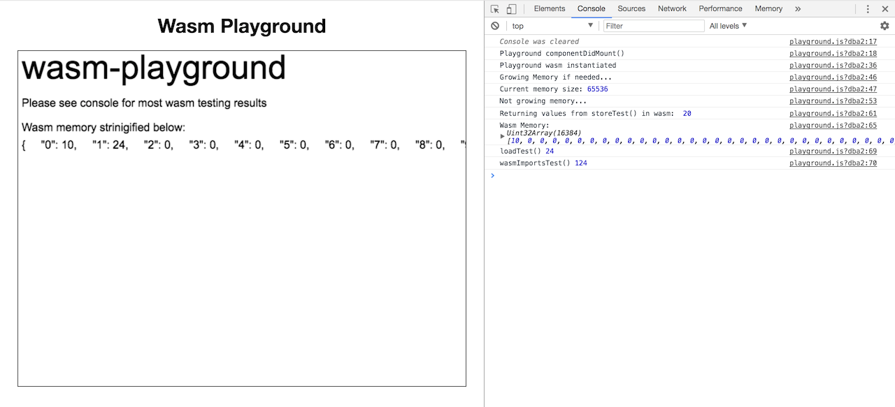

# wasm-playground

A Wasm playground with preact as a shell. Goal is to offer multiple sources of compiling wasm, but personally only uses my favorite: [Assemblyscript](https://github.com/AssemblyScript/assemblyscript). Was used as a starting ground for [Wasmboy](https://github.com/torch2424/wasmBoy).



# Project Layout

* `wasm/` - folder with source for wasm modules, with subdirectories for the language used.

* `index.js` - base app component for the preact shell.

* `playground.js` - component that interacts with the wasm module.

* `dist/` - build output for wasm modules


# How the Playground was built.

* Install [AssemblyScript](https://github.com/AssemblyScript/assemblyscript).

`npm install --save-dev AssemblyScript/assemblyscript`

* Install the [preact cli](https://github.com/developit/preact-cli)

* Create a preact project with the preact cli

`preact create simple <project-name>`.

* Serve the react Project

`npm run dev`

* Create a npm script step for building wasm in your `package.json`

`"wasm:build": "mkdir -p dist/wasm/assemblyscript && npx asc wasm/assemblyscript/index.ts -b dist/wasm/assemblyscript/index.untouched.wasm -t dist/wasm/assemblyscript/index.untouched.wast --validate && echo \"Done!\""`

* Create a npm script for watching your wasm files to build them using [watch]()

`"wasm:watch": "npx watch \"npm run wasm:build\" wasm"`

* Run the wasm watcher/builder

`npm run wasm:watch`

# Other Planned Wasm Compilers

Currently no docs, but in the Future, Go:

* https://github.com/golang/go/issues/18892
* https://github.com/neelance/go/tree/wasm-wip/misc/wasm

### Usage (CLI Commands):

``` bash
# install dependencies
npm install

# serve with hot reload at localhost:8080
npm run dev

# Watch wasm/ folder for changes, and rebuild on changes
npm run wasm:watch

# build for production with minification
npm run build

# Build the wasm into a wasm module
npm run wasm:build

# test the production build locally
npm run serve
```

For detailed explanation on how things work, checkout the [CLI Readme](https://github.com/developit/preact-cli/blob/master/README.md).
